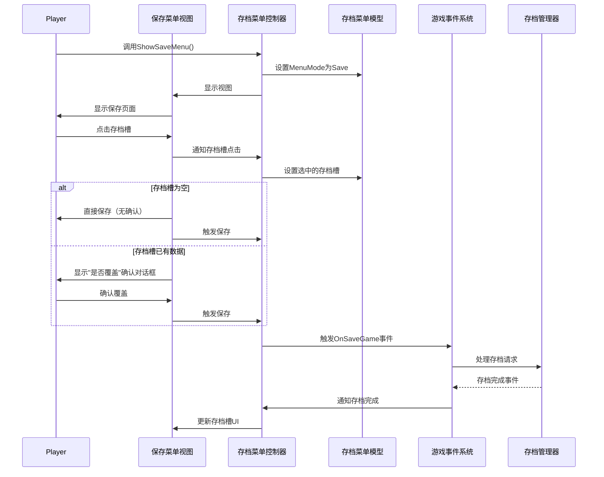
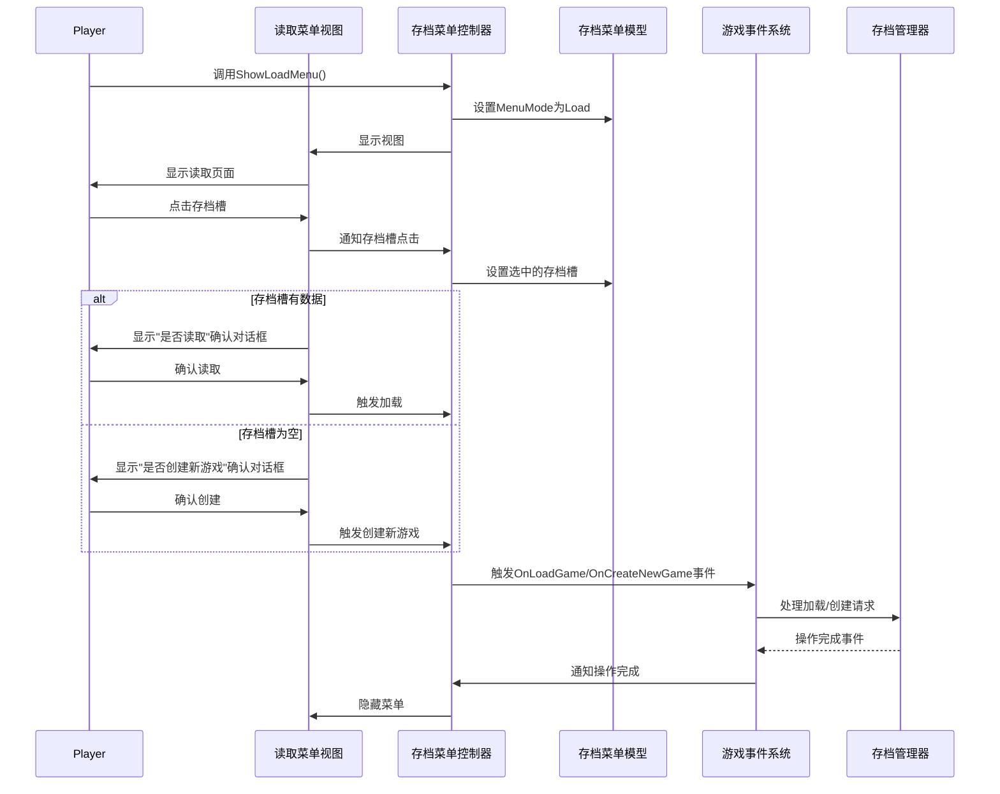
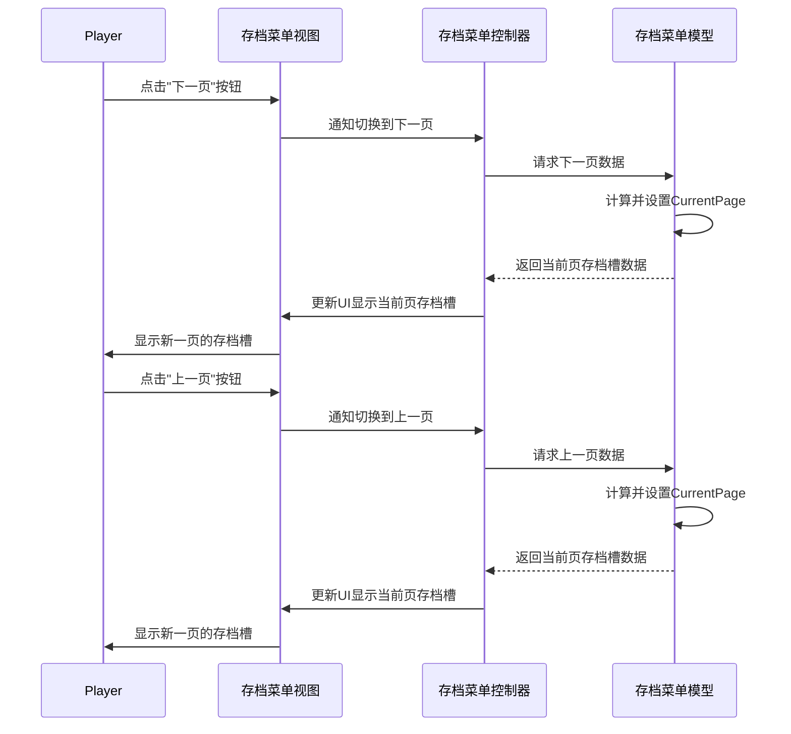

## 1. 系统概述

本技术方案旨在重构游戏的存档系统，将原有的单一存档菜单分为保存页面和读取页面，采用相同页面但通过不同进入方法执行不同行为。保存页面提示是否保存/覆盖，读取页面提示是否读取/创建新游戏，替代现有的二级菜单。同时，将存档页面设计为分页式排布，提升用户体验。

## 2. 架构设计

### 2.1 MVC架构

系统采用MVC（模型-视图-控制器）架构设计：

- **模型（Model）**：负责管理存档数据和业务逻辑
- **视图（View）**：负责显示UI元素和处理用户交互
- **控制器（Controller）**：作为模型和视图之间的桥梁，处理用户输入并更新模型和视图

### 2.2 类图

```mermaid
classDiagram
    direction TB
    
    %% 枚举定义
    class MenuMode {
        <<enumeration>>
        Save
        Load
    }
    
    %% 数据类
    class SaveData {
        +string saveTime
        +string version
        +GameProgress gameProgress
        // 其他游戏数据
    }
    
    class SaveSlotInfo {
        +string SlotName
        +string DisplayName
        +bool HasSave
        +string LastModified
        +string Version
        +string ProgressText
        +SaveData SaveData
        +bool IsAutoSave
    }
    
    %% MVC 模式类
    class SaveLoadMenuModel {
        -SaveData _selectedSaveData
        -string _selectedSaveSlotName
        -bool _isAutoSaveSlot
        -List~SaveSlotInfo~ _saveSlots
        -MenuMode _currentMenuMode
        -int _totalPages
        -int _currentPage
        -int _slotsPerPage
        +event Action OnSaveSlotsUpdated
        +event Action OnSelectedSaveSlotChanged
        +event Action OnPageChanged
        +SaveData SelectedSaveData
        +string SelectedSaveSlotName
        +bool IsAutoSaveSlot
        +List~SaveSlotInfo~ SaveSlots
        +MenuMode CurrentMenuMode
        +int TotalPages
        +int CurrentPage
        +int SlotsPerPage
        +Initialize()
        +Cleanup()
        +SetSelectedSaveSlot(string, SaveData)
        +UpdateSaveSlots(List~SaveSlotInfo~)
        +SetMenuMode(MenuMode)
        +SetCurrentPage(int)
        +GetSaveSlotsForCurrentPage()
        +NextPage()
        +PreviousPage()
    }
    
    class SaveLoadMenuView {
        -SaveLoadMenuController m_controller
        -SaveLoadMenuModel _model
        -List~ISaveSlotUI~ _saveSlotUIs
        -Transform saveSlotsContainer
        -AssetReference saveSlotPrefabRef
        -ScrollRect saveScrollRect
        -GameObject saveOptionsPanel
        -GameObject confirmPanel
        -TextMeshProUGUI _menuTitleText
        -Button nextPageButton
        -Button prevPageButton
        -TextMeshProUGUI pageIndicatorText
        +SaveLoadMenuController Controller
        +SaveLoadMenuModel Model
        +Initialize()
        +UpdateView()
        +Show()
        +Hide()
        +ShowSaveOptionsMenu(ISaveSlotUI)
        +HideSaveOptionsMenu()
        +ShowConfirmPanel(ConfirmType)
        +HideConfirmPanel()
        +HandleSaveButtonClick()
        +HandleLoadButtonClick()
        +HandleDeleteButtonClick()
        +HandleConfirmButtonClick()
        +HandleCancelButtonClick()
        +HandleNextPageButtonClick()
        +HandlePreviousPageButtonClick()
        +UpdatePaginationUI()
    }
    
    class SaveLoadMenuController {
        -SaveLoadMenuModel _model
        -SaveLoadMenuView _view
        -SaveLoadMenuConfig _config
        +SaveLoadMenuModel Model
        +SaveLoadMenuView View
        +SaveLoadMenuConfig Config
        +InitializeMVC()
        +RegisterEvents()
        +UnregisterEvents()
        +InitializeSaveSlots()
        +HandleSaveGame(string)
        +HandleLoadGame(string)
        +HandleDeleteSave(string)
        +HandleCreateNewGame()
        +Show()
        +ShowSaveMenu()
        +ShowLoadMenu()
        +Hide()
        +HandleNextPage()
        +HandlePreviousPage()
        +HandlePageChange(int)
    }
    
    %% 关系定义
    SaveLoadMenuModel --> SaveSlotInfo : 包含
    SaveSlotInfo --> SaveData : 包含
    SaveLoadMenuModel --> MenuMode : 使用
    
    SaveLoadMenuView --> SaveLoadMenuController : 依赖
    SaveLoadMenuView --> SaveLoadMenuModel : 观察
    SaveLoadMenuController --> SaveLoadMenuModel : 控制
    SaveLoadMenuController --> SaveLoadMenuView : 控制
    
    SaveLoadMenuController ..> GameEvents : 触发
    SaveLoadMenuController ..> SaveManager : 调用
```

## 3. 核心功能流程

### 3.1 保存模式流程

### 3.2 读取模式流程

### 3.3 分页功能流程

## 4. 实现细节

### 4.1 模型（Model）实现

- `MenuMode`枚举定义在类外部，表示当前菜单模式（Save或Load）
- 添加`CurrentMenuMode`属性和`SetMenuMode`方法管理菜单模式
- 维护存档槽列表和选中状态
- 增加分页相关属性：`TotalPages`、`CurrentPage`、`SlotsPerPage`
- 增加分页相关方法：`SetCurrentPage`、`GetSaveSlotsForCurrentPage`、`NextPage`、`PreviousPage`
- 添加`OnPageChanged`事件通知视图页面变化

### 4.2 控制器（Controller）实现

- 添加`ShowSaveMenu()`和`ShowLoadMenu()`方法，分别以保存和读取模式显示菜单
- `Show()`方法默认调用`ShowSaveMenu()`保持向后兼容
- 处理保存、加载、删除和创建新游戏的业务逻辑
- 管理视图和模型之间的通信
- 增加分页相关处理方法：`HandleNextPage`、`HandlePreviousPage`、`HandlePageChange`

### 4.3 视图（View）实现

- 根据当前菜单模式调整UI显示
- 在保存模式下，点击有存档的槽位显示"是否覆盖"确认
- 在读取模式下，点击有存档的槽位显示"是否读取"确认，点击空槽位显示"是否创建新游戏"确认
- 移除现有的二级菜单，简化用户交互流程
- 增加分页UI元素：上一页按钮、下一页按钮、页码指示器
- 增加分页相关事件处理：`HandleNextPageButtonClick`、`HandlePreviousPageButtonClick`
- 增加分页UI更新方法：`UpdatePaginationUI`
- 仅显示当前页的存档槽，通过分页控件切换查看其他存档槽

## 5. 技术要点

1. **模式切换机制**：通过模型中的`MenuMode`控制菜单行为
2. **分页式排布**：实现存档槽的分页显示，解决大量存档槽的显示问题
3. **确认对话框复用**：使用同一确认对话框组件，根据当前模式和操作类型显示不同文本
4. **事件驱动架构**：通过事件系统实现组件间松耦合通信
5. **UI优化**：简化交互流程，提供清晰的操作反馈

## 6. 后续开发步骤

1. 更新`SaveLoadMenuModel.cs`添加模式控制和分页相关代码
2. 修改`SaveLoadMenuController.cs`实现不同的进入方法和分页逻辑
3. 重构`SaveLoadMenuView.cs`移除二级菜单逻辑，实现基于模式的确认流程和分页UI
4. 测试保存和读取流程，确保功能正常
5. 优化UI交互体验