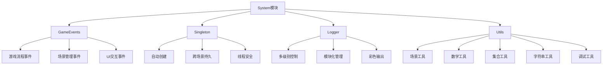

# System 模块文档

## 📋 模块概述

System模块是Unity Game Jam工具箱的核心系统模块，提供了游戏开发中常用的基础系统功能，包括事件系统、单例模式、日志系统等。该模块为其他所有模块提供基础架构支持。

## 🎯 核心组件

### 1. 事件系统 - GameEvents

**文件位置**: `Assets/Scripts/System/GameEvents.cs`

**命名空间**: `MyGame.Events`

**功能描述**:
- 提供类型安全的事件注册与触发机制
- 支持游戏流程、场景管理、UI交互等各类事件
- 实现模块间解耦通信

**主要事件类型**:

#### 游戏流程事件
- `OnGameStart` - 游戏开始事件
- `OnGamePause` - 游戏暂停事件
- `OnGameResume` - 游戏继续事件
- `OnGameOver(bool)` - 游戏结束事件（参数：true胜利/false失败）
- `OnGameStateChanged(GameState, GameState)` - 游戏状态变更事件

#### 场景管理事件
- `OnSceneLoadStart(string)` - 场景加载开始事件
- `OnSceneLoadComplete(string)` - 场景加载完成事件
- `OnSceneUnload(string)` - 场景卸载事件

#### UI交互事件
- `OnMainMenuShow(bool)` - 主菜单显示/隐藏事件
- `OnPauseMenuShow(bool)` - 暂停菜单显示/隐藏事件
- `OnResultPanelShow(bool)` - 结算界面显示事件
- `OnHUDShow(bool)` - HUD显示/隐藏事件
- `OnConsoleShow(bool)` - 控制台显示/隐藏事件
- `OnInventoryShow(bool)` - 背包显示/隐藏事件
- `OnSettingsPanelShow(bool)` - 设置面板显示/隐藏事件
- `OnAboutPanelShow(bool)` - 关于面板显示/隐藏事件

#### UI状态切换事件
- `OnMenuShow(UIState, bool)` - UI状态切换事件（互斥显示）

**使用示例**:

```csharp
using MyGame.Events;

// 注册事件监听
GameEvents.OnGameStart += HandleGameStart;
GameEvents.OnGamePause += HandleGamePause;

// 触发事件
GameEvents.TriggerGameStart();
GameEvents.TriggerGamePause();

// 注销事件监听
GameEvents.OnGameStart -= HandleGameStart;
```

### 2. 单例模式 - Singleton<T>

**文件位置**: `Assets/Scripts/System/Singleton.cs`

**命名空间**: `MyGame`

**功能描述**:
- 通用MonoBehaviour单例基类
- 自动创建和管理全局唯一实例
- 支持DontDestroyOnLoad，确保跨场景持久化
- 线程安全的单例实现

**使用示例**:

```csharp
using MyGame;

public class GameManager : Singleton<GameManager>
{
    public int score;
    
    protected override void Awake()
    {
        base.Awake();
        // 自定义初始化逻辑
    }
}

// 使用方式
GameManager.Instance.score = 100;
```

### 3. 日志系统 - Logger

**文件位置**: `Assets/Scripts/System/Logger/`

**主要文件**:
- `Logger.cs` - 核心日志功能
- `LogModules.cs` - 日志模块常量定义

**功能描述**:
- 统一日志输出格式
- 支持多级别日志控制
- 支持模块化管理
- 支持彩色日志输出
- 支持上下文关联

**日志级别**:
- `None` - 关闭所有日志
- `Error` - 仅显示错误日志
- `Warning` - 显示警告和错误日志
- `Info` - 显示信息、警告和错误日志
- `Debug` - 显示所有日志（包括调试信息）

**日志模块常量**:
- `SYSTEM` - 系统模块
- `GAMEMANAGER` - 游戏管理器模块
- `UI` - UI模块
- `GAMEDATA` - 游戏数据模块
- `SAVE` - 存档模块
- `DEVTOOLS` - 调试工具模块
- `CONSOLE` - 控制台模块
- `PLAYER` - 玩家模块
- `AUDIO` - 音频模块
- `SCENE` - 场景模块
- `INVENTORY` - 背包模块

**使用示例**:

```csharp
using static LogModules;

// 基础日志
Logger.Log(SYSTEM, "系统初始化完成");

// 警告日志
Logger.Warning(UI, "UI元素未找到");

// 错误日志
Logger.Error(GAMEMANAGER, "游戏状态转换失败");

// 彩色日志
Logger.LogColor(SYSTEM, "成功消息", Color.green);

// 调试日志（仅在开发版本显示）
Logger.DebugLog(SYSTEM, "调试信息");
```

### 4. 系统工具类 - Utils

**文件位置**: `Assets/Scripts/System/Utils.cs`

**命名空间**: `MyGame.System`

**功能描述**:
- 提供常用的系统级工具方法
- 包含场景管理、数学计算、集合操作、字符串处理等工具
- 所有方法均为静态方法，方便调用

**主要功能**:

#### 场景工具
- `CanLoadScene(string sceneName)` - 检查场景是否可以加载（验证场景是否存在）
- `GetSceneLoadOperation(string sceneName, LoadSceneMode loadMode)` - 获取场景加载操作的 AsyncOperation（供上层管理器使用，不直接执行加载）

#### 数学工具
- `SmoothDamp()` - 平滑插值
- `NormalizeAngle()` - 角度标准化
- `AngleDifference()` - 角度差计算

#### 集合工具
- `SafeGet()` - 安全获取列表元素
- `RandomElement()` - 随机获取元素
- `Shuffle()` - 打乱列表顺序

#### 字符串工具
- `FormatTime()` - 格式化时间显示
- `Truncate()` - 截断字符串

#### 调试工具
- `DrawBounds()` - 绘制调试边界框

**使用示例**:

```csharp
using MyGame.System;
```csharp
// 使用场景工具（仅作为底层支持，实际场景切换应使用 SceneSwitcher）
if (Utils.CanLoadScene("MainMenu"))
{
    // 获取加载操作供上层管理器使用
    AsyncOperation operation = Utils.GetSceneLoadOperation("MainMenu", LoadSceneMode.Single);
    if (operation != null)
    {
        // 将操作传递给 SceneSwitcher 或其他管理器处理
        SceneSwitcher.Instance.StartSceneTransition(operation, "MainMenu");
    }
}
```
// 格式化时间
string timeText = Utils.FormatTime(125.5f); // "02:05"

// 随机获取元素
string randomSound = soundList.RandomElement();

// 绘制调试边界
Utils.DrawBounds(collider.bounds, Color.red);
```

## 🛠️ 配置与使用

### 日志级别设置

在运行时动态调整日志级别：

```csharp
Logger.currentLogLevel = Logger.LogLevel.Debug;
```

### 自定义日志模块

在`LogModules.cs`中添加新的模块常量：

```csharp
public const string AUDIO = "AUDIO";
public const string NETWORK = "NETWORK";
```

### 事件系统最佳实践

1. **事件命名规范**:
   - 事件名以`On`开头，清晰描述事件类型
   - 触发方法以`Trigger`开头，与事件名对应

2. **事件注册与注销**:
   - 在`OnEnable`中注册事件
   - 在`OnDisable`中注销事件
   - 避免内存泄漏

3. **线程安全**:
   - 所有事件都在Unity主线程中触发
   - 避免在事件回调中进行耗时操作

## 📊 系统架构图



## 🔗 相关模块

- **[GameData](../GameData/README.md)** - 使用Logger进行数据操作日志记录
- **[UI](../UI/README.md)** - 使用GameEvents处理UI交互事件
- **[Managers](../Managers/README.md)** - 使用Singleton<T>实现各种管理器

## 🚀 快速开始

1. **添加System模块引用**:
   ```csharp
   using MyGame;
   using MyGame.Events;
   using MyGame.System;
   ```

2. **创建管理器类**:
   ```csharp
   public class AudioManager : Singleton<AudioManager>
   {
       void Start()
       {
           GameEvents.OnGameStart += HandleGameStart;
           Logger.Log(LogModules.AUDIO, "音频管理器初始化");
       }
       
       void HandleGameStart()
       {
           Logger.Log(LogModules.AUDIO, "游戏开始，播放背景音乐");
       }
   }
   ```

3. **使用事件系统**:
   ```csharp
   // 注册事件
   void OnEnable()
   {
       GameEvents.OnSceneLoadComplete += OnSceneLoaded;
   }
   
   // 处理事件
   void OnSceneLoaded(string sceneName)
   {
       Logger.Log(LogModules.SCENE, $"场景 {sceneName} 加载完成");
       
       // 使用工具类格式化时间
       string loadTime = Utils.FormatTime(Time.time);
       Logger.Log(LogModules.SCENE, $"加载耗时: {loadTime}");
   }
   
   // 注销事件
   void OnDisable()
   {
       GameEvents.OnSceneLoadComplete -= OnSceneLoaded;
   }
   ```

4. **使用工具类**:
   ```csharp
   // 异步加载场景
   public class SceneController : MonoBehaviour
   {
       public void LoadGameScene()
       {
           StartCoroutine(Utils.LoadSceneAsync("GameScene", 
               progress => Debug.Log($"加载进度: {progress:P}"),
               () => Logger.Log(LogModules.SCENE, "游戏场景加载完成")
           ));
       }
   }
   
   // 使用集合工具
   public class RandomSpawner : MonoBehaviour
   {
       public List<GameObject> prefabs;
       
       void SpawnRandom()
       {
           GameObject prefab = prefabs.RandomElement();
           if (prefab != null)
           {
               Instantiate(prefab, transform.position, Quaternion.identity);
           }
       }
   }
   ```