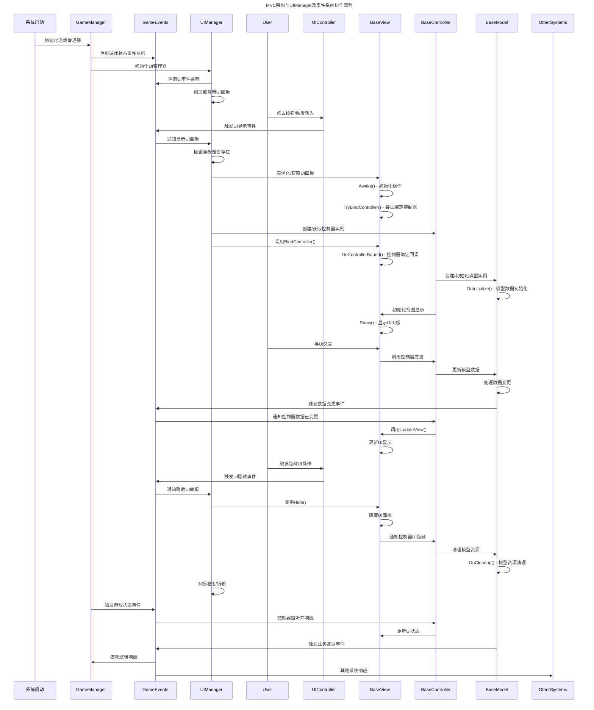

# MVC架构与UIManager及事件系统协作时序图

下面是MVC架构、UIManager和事件系统之间的详细协作时序图，展示了从用户交互到UI更新的完整流程：

## 时序图说明

这个时序图展示了以下几个核心流程：

### 1. 初始化阶段
- 游戏启动时，GameManager和UIManager依次初始化
- 各管理器向GameEvents注册事件监听器
- UIManager预加载常用UI面板以提高性能

### 2. UI显示流程
- 用户交互触发UIController调用GameEvents显示UI
- UIManager接收到事件后实例化或从缓存获取UI面板
- UI面板初始化并尝试绑定对应的控制器
- 控制器创建并初始化模型，完成后更新视图显示

### 3. 用户交互处理
- 用户与UI交互时，视图将操作转发给控制器
- 控制器处理业务逻辑并更新模型数据
- 模型数据变更后触发事件通知相关系统
- 控制器监听模型事件并更新视图显示

### 4. UI隐藏流程
- 用户触发隐藏UI操作，通过事件系统通知UIManager
- UIManager调用面板的Hide方法并进行资源管理
- 控制器和模型执行必要的清理工作

### 5. 全局事件流
- GameManager和其他系统通过GameEvents发送全局事件
- 控制器监听相关事件并更新UI状态
- 模型数据变更也通过事件系统通知全局

这种基于事件的MVC架构实现了各组件的松耦合协作，使代码更易于维护和扩展，特别适合复杂的游戏UI系统。