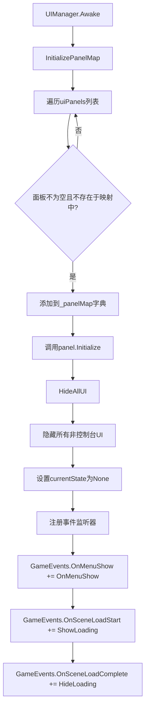
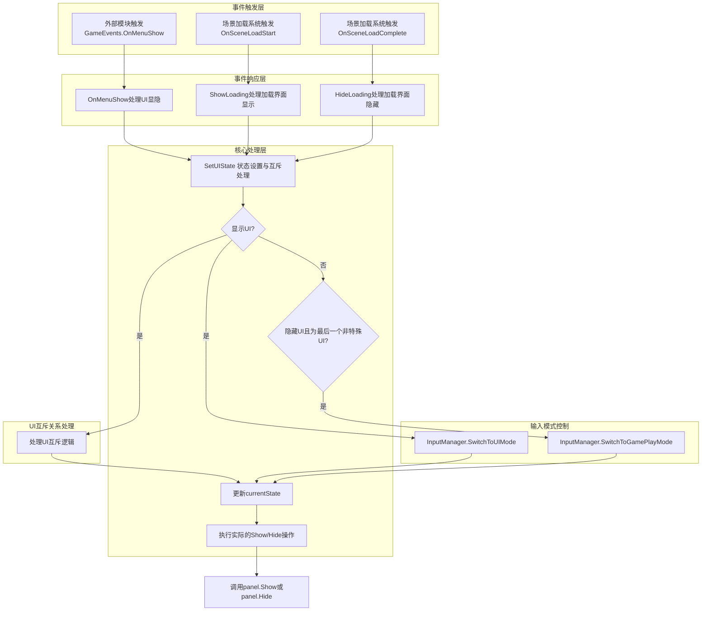
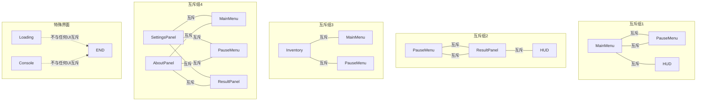
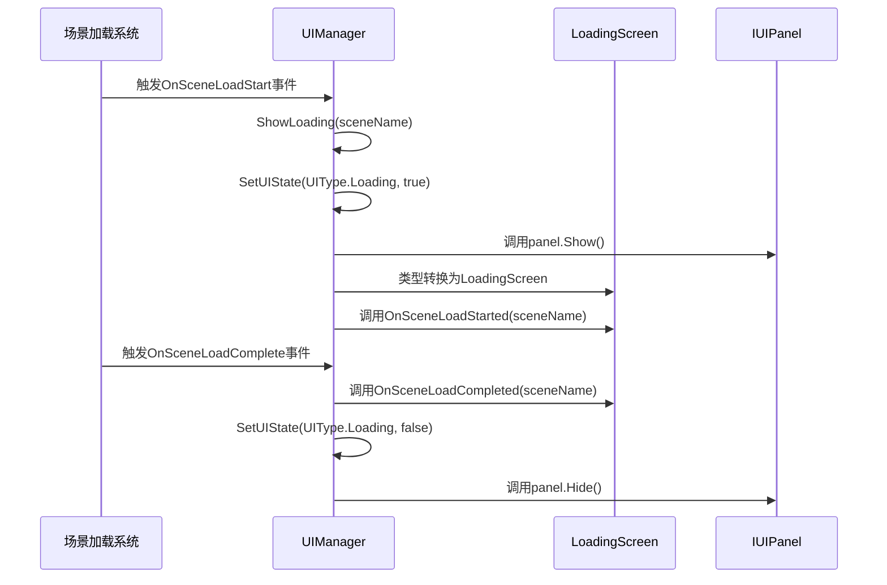

# UIManager UI显隐控制链流程图

## 概述
本文档详细分析了`UIManager`类中的UI显隐控制流程，包括初始化、事件响应、UI状态管理以及界面互斥关系的处理机制。

## 初始化流程



## UI显隐核心控制流程



## UI互斥关系图



## 加载界面显隐流程



## 关键控制方法说明

### SetUIState 方法流程

```mermaid
flowchart TD
    A[SetUIState(UIType state, bool show)] --> B{show为true?}
    B -->|是| C{InputManager实例存在?}
    C -->|是| D{state不是Console或Loading?}
    D -->|是| E[InputManager.SwitchToUIMode]
    
    B -->|是| F[处理UI互斥关系]
    F --> G[根据state类型调用SetUIState隐藏互斥UI]
    
    B -->|否| H{currentState == state且非特殊UI?}
    H -->|是| I{InputManager实例存在?}
    I -->|是| J[InputManager.SwitchToGamePlayMode]
    
    G --> K[更新currentState]
    E --> K
    J --> K
    
    K --> L{_panelMap中存在该state?}
    L -->|是| M{show为true?}
    M -->|是| N[panel.Show()]
    M -->|否| O[panel.Hide()]
    L -->|否| P[结束]
```

## 代码优化建议

1. **错误处理增强**：在尝试类型转换和调用面板方法时添加更健壮的错误处理，避免空引用异常。

2. **UI层级管理**：考虑添加UI层级管理机制，确保UI显示在正确的层级上。

3. **异步加载支持**：为复杂UI面板添加异步加载支持，提高性能和用户体验。

4. **事件参数封装**：将UI显隐事件的参数封装为专用的事件数据类，提高代码可维护性。

5. **状态验证**：添加状态验证逻辑，防止非法状态切换。

## 输入输出示例

#### 输入输出示例
输入：
```csharp
// 外部系统触发主菜单显示
GameEvents.OnMenuShow?.Invoke(UIType.MainMenu, true);
```

输出：
```
1. UIManager.OnMenuShow 被调用
2. SetUIState(UIType.MainMenu, true) 被调用
3. 检查InputManager并切换到UIMode
4. 隐藏互斥UI (PauseMenu, HUD)
5. 更新currentState为MainMenu
6. 调用MainMenu面板的Show()方法
```

通过以上流程图和说明，可以清晰地了解`UIManager`中UI显隐控制的完整链路和机制。