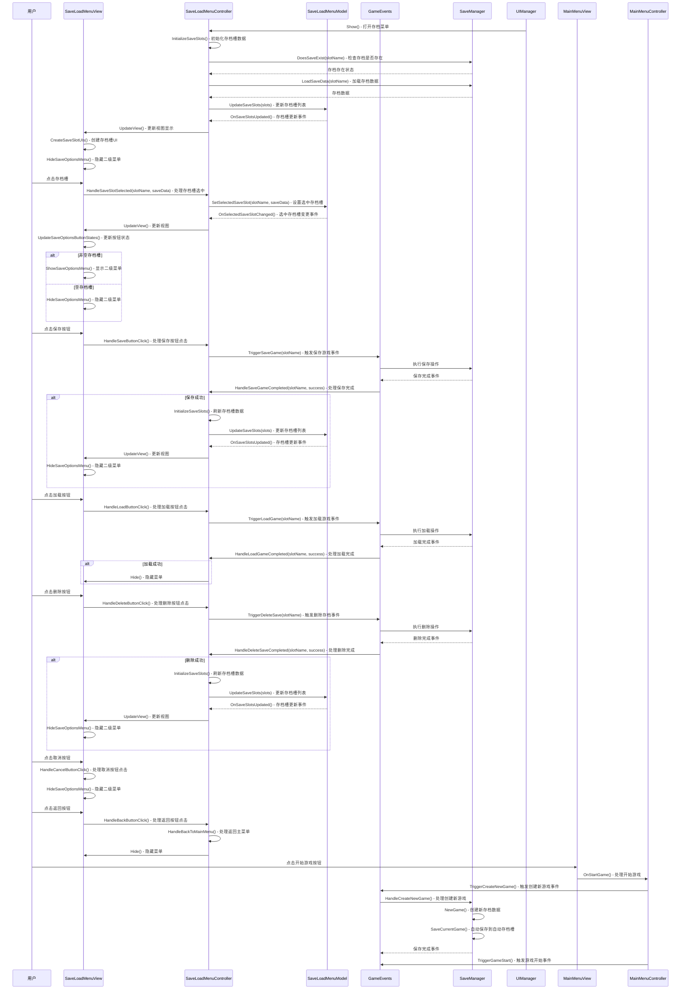

# 存档菜单操作流程时序图

根据存档菜单系统的MVC架构和实现代码，以下是完整的操作流程时序图：

## 时序图说明

时序图展示了存档菜单系统的完整操作流程，包括以下几个主要阶段：

1. **初始化阶段**：UIManager打开存档菜单，控制器初始化存档槽数据，视图创建UI并显示存档列表。

2. **存档槽选择阶段**：用户点击存档槽，视图通知控制器，控制器更新模型中的选中状态，视图根据存档槽是否为空决定是否显示二级菜单。

3. **核心操作阶段**：
   - **保存游戏**：用户点击保存按钮，控制器触发游戏保存事件，SaveManager执行保存操作，完成后刷新UI。
   - **加载游戏**：用户点击加载按钮，控制器触发游戏加载事件，SaveManager执行加载操作，完成后隐藏菜单。
   - **删除存档**：用户点击删除按钮，控制器触发删除存档事件，SaveManager执行删除操作，完成后刷新UI。

4. **辅助操作阶段**：包括取消操作（隐藏二级菜单）和返回主菜单（隐藏整个存档菜单）。

5. **主菜单开始游戏自动创建存档流程**：
   - 用户点击主菜单的开始游戏按钮
   - MainMenuController先触发创建新游戏事件，自动保存新存档到自动存档槽
   - SaveManager处理创建新游戏事件，初始化存档数据并执行保存
   - 保存完成后，MainMenuController再触发游戏开始事件

整个流程采用了MVC架构和事件驱动设计，各组件间职责清晰，实现了解耦。视图负责UI显示和用户交互，控制器负责业务逻辑和事件转发，模型负责数据管理，而GameEvents则提供了跨系统通信机制。