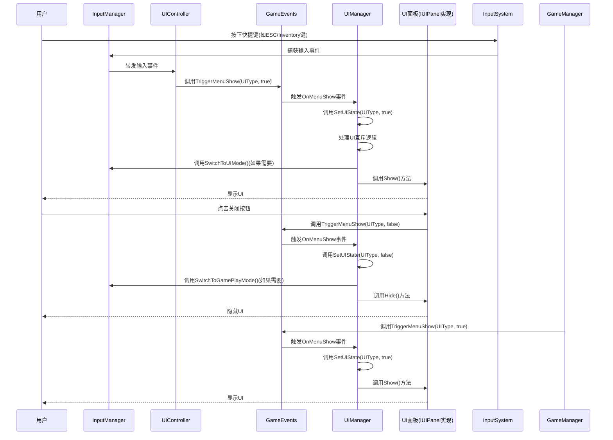

# UI开关控制模式时序图

本文档详细说明了当前游戏项目中UI开关控制的完整流程，从用户输入到UI显示/隐藏的整个调用链。

## 1. UI开关控制整体架构

整个UI控制系统采用了事件驱动的架构设计，通过全局事件系统实现了模块间的解耦。主要涉及以下核心组件：

- **输入系统 (InputSystem/InputManager)**: 捕获用户输入
- **控制器 (UIController等)**: 处理输入并触发事件
- **事件系统 (GameEvents)**: 全局事件分发中心
- **UI管理器 (UIManager)**: 统一管理UI面板的显示/隐藏
- **UI面板 (实现IUIPanel的各类UI)**: 具体的UI显示组件

## 2. UI开关控制详细时序图



## 3. 关键代码实现说明

### 3.1 事件定义与触发 (GameEvents.cs)

```csharp
/// <summary>
/// UI状态切换事件（统一管理所有UI的显示/隐藏）
/// </summary>
public static event Action<UIType, bool> OnMenuShow;

public static void TriggerMenuShow(UIType menu, bool show)
{
    Log.Info(module, $"UI切换：{menu} 显示：{show}");
    OnMenuShow?.Invoke(menu, show);
}
```

### 3.2 事件订阅与处理 (UIManager.cs)

```csharp
protected override void Awake()
{
    base.Awake();
    
    // 初始化面板映射
    InitializePanelMap();
    
    // 初始隐藏所有UI
    HideAllUI();

    // 注册UI相关事件监听
    GameEvents.OnMenuShow += OnMenuShow;    // UI显隐处理
    // 加载界面显隐处理方法
    GameEvents.OnSceneLoadStart += ShowLoading;
    GameEvents.OnSceneLoadComplete += HideLoading;
}

private void OnMenuShow(UIType state, bool show)
{
    SetUIState(state, show);
}
```

### 3.3 UI状态管理核心方法 (UIManager.cs)

```csharp
/// <summary>
/// 设置UI状态并处理互斥关系
/// </summary>
private void SetUIState(UIType state, bool show)
{
    // 处理互斥关系
    if (show)
    {
        // 使用InputManager切换输入模式
        if (InputManager.Instance != null)
        {
            // 对于需要完全UI控制的界面，切换到UI模式
            if (state != UIType.Console && state != UIType.Loading)
            {
                InputManager.Instance.SwitchToUIMode();
            }
        }
        
        // 处理不同UI之间的互斥逻辑
        switch (state)
        {
            case UIType.MainMenu:
                SetUIState(UIType.PauseMenu, false);
                SetUIState(UIType.HUD, false);
                break;
            case UIType.PauseMenu:
                SetUIState(UIType.MainMenu, false);
                SetUIState(UIType.ResultPanel, false);
                break;
            // ... 其他UI互斥关系处理
        }
    }
    else if (currentState == state && currentState != UIType.None && currentState != UIType.Loading && currentState != UIType.Console)
    {
        // 当关闭最后一个UI时，切换回游戏玩法模式
        if (InputManager.Instance != null)
        {
            InputManager.Instance.SwitchToGamePlayMode();
        }
    }

    // 更新当前状态
    if (show) currentState = state;
    else if (currentState == state) currentState = UIType.None;

    // 根据状态显示/隐藏对应UI
    if (_panelMap.TryGetValue(state, out var panel))
    {
        if (show)
            panel.Show();
        else
            panel.Hide();
    }
}
```

### 3.4 UI控制器输入处理 (UIController.cs)

UIController负责监听输入事件并触发对应的UI显示/隐藏事件。

## 4. UI面板类型枚举 (UIEnum.cs)

```csharp
/// <summary>
/// UI面板类型枚举，用于UIManager进行状态管理和面板分类
/// </summary>
public enum UIType
{
    None,
    MainMenu,
    PauseMenu,
    ResultPanel,
    HUD,
    Loading,
    Console,
    Inventory,
    SettingsPanel,
    AboutPanel,
}
```

## 5. UI面板接口定义 (IUIPanel.cs)

```csharp
/// <summary>
/// UI面板接口，定义了所有UI面板需要实现的基础方法
/// </summary>
public interface IUIPanel
{
    /// <summary>
    /// 显示面板
    /// </summary>
    void Show();
    
    /// <summary>
    /// 隐藏面板
    /// </summary>
    void Hide();
    
    /// <summary>
    /// 是否显示面板
    /// </summary>
    bool IsVisible { get; }
    
    /// <summary>
    /// 面板类型，用于UIManager进行状态管理
    /// </summary>
    UIType PanelType { get; }
    
    /// <summary>
    /// 初始化面板
    /// </summary>
    void Initialize();
    
    /// <summary>
    /// 清理面板资源
    /// </summary>
    void Cleanup();
}
```

## 6. 工作流程总结

1. **初始化阶段**：
   - UIManager在Awake时初始化所有UI面板并建立_panelMap映射
   - UIManager订阅GameEvents.OnMenuShow事件
   - 各控制器(UIController等)初始化并准备处理输入事件

2. **UI显示流程**：
   - 用户输入被InputSystem捕获并通过InputManager转发
   - 控制器调用GameEvents.TriggerMenuShow()触发事件
   - UIManager响应事件并调用SetUIState()
   - SetUIState()处理UI互斥逻辑并调用对应面板的Show()方法
   - 需要时切换输入模式为UI模式

3. **UI隐藏流程**：
   - 同样通过GameEvents.TriggerMenuShow()触发，但show参数为false
   - UIManager调用SetUIState()处理隐藏逻辑
   - 如果关闭的是最后一个主要UI，切换回游戏玩法模式

这种集中式的UI管理架构实现了以下优势：
- **模块解耦**：各系统通过事件通信，不直接依赖
- **统一管理**：所有UI状态变更都经过UIManager处理
- **互斥控制**：轻松管理不同UI之间的显示/隐藏关系
- **输入模式切换**：根据当前UI状态自动切换输入模式

此架构使UI系统更易于维护和扩展，添加新UI面板只需实现IUIPanel接口并在UIManager中注册即可。