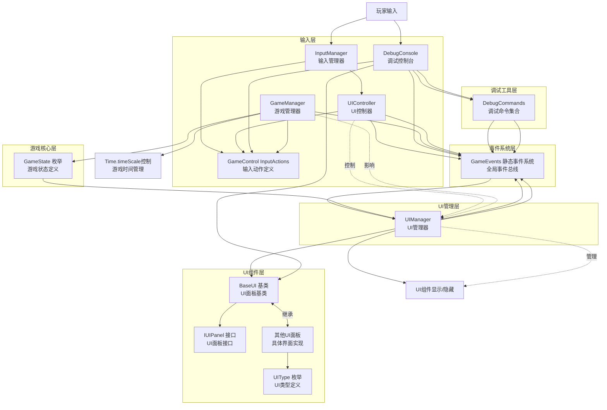
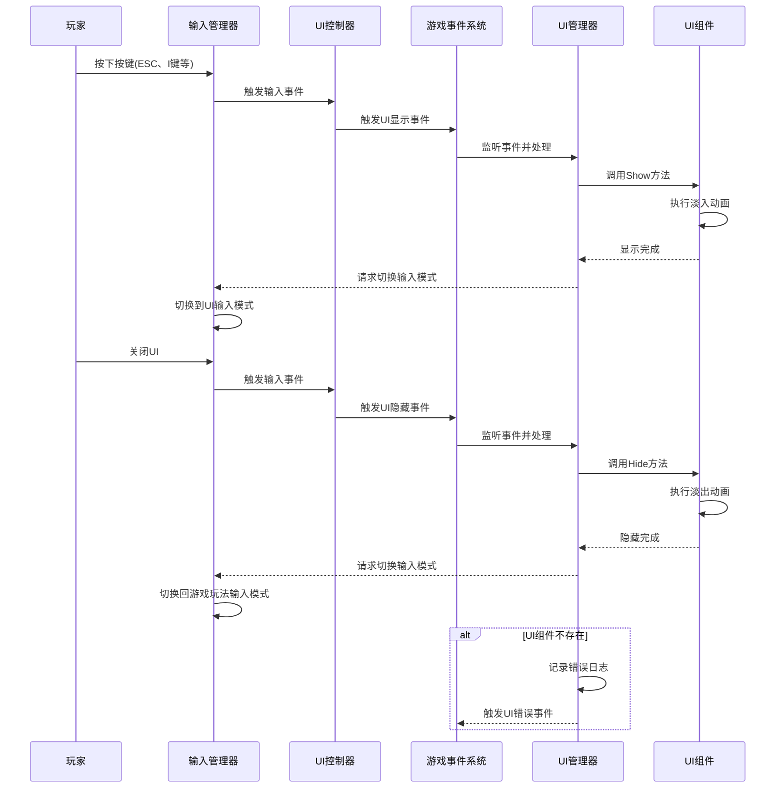
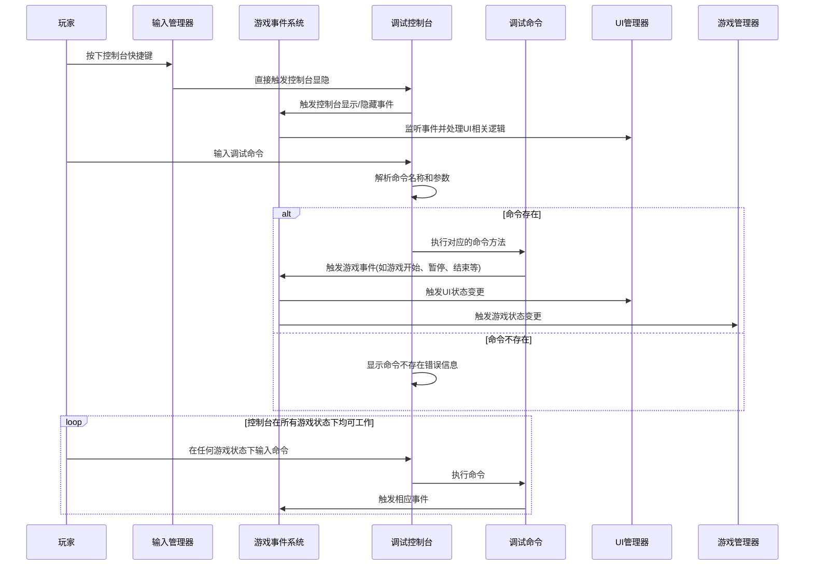
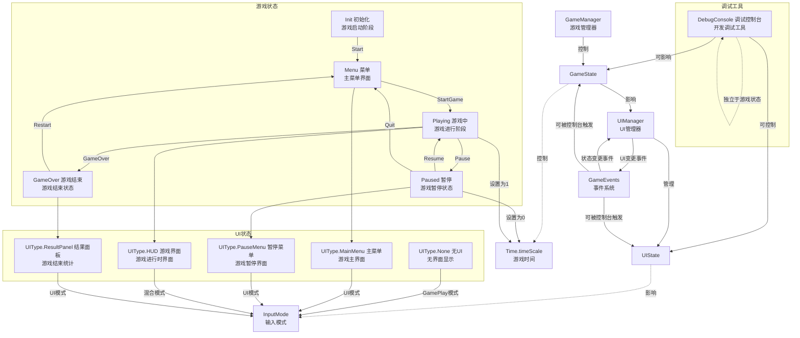

# UI系统架构文档

本文档使用mermaid图表可视化了游戏UI系统和相关核心模块的架构设计、组件关系和交互流程。

## 1. 系统组件关系图



## 2. UI交互时序图



## 3. 调试控制台交互流程图



## 4. 游戏状态与UI交互图



## 5. 核心模块说明

### 5.1 输入管理系统
- **InputManager**: 单例类，负责管理Unity的InputSystem实例，提供输入模式切换功能
- **UIController**: 单例类，负责处理UI相关的输入事件，监听唤出UI的按键并触发对应事件
- **GameControl**: 输入动作定义，包含GamePlay和UI两种输入模式

### 5.2 UI管理系统
- **UIManager**: 单例类，负责管理所有UI面板的显示、隐藏和状态管理
- **IUIPanel**: 接口定义UI面板的基本方法
- **BaseUI**: 抽象类，实现IUIPanel接口并提供淡入淡出动画等基础功能
- **UIType**: 枚举类型，定义所有UI面板的类型

### 5.3 事件系统
- **GameEvents**: 静态事件系统，负责模块间通信，提供各种游戏事件的订阅和触发机制

### 5.4 游戏核心
- **GameManager**: 单例类，负责控制游戏主流程和状态切换
- **GameState**: 枚举类型，定义游戏的各种状态

### 5.5 调试工具（特殊独立模块）
- **DebugConsole**: 独立的调试控制台，具有以下特殊性：
  - 可在任何游戏状态下被激活和使用
  - 直接与InputManager交互，不经过常规UI的事件触发流程
  - 可以绕过常规游戏流程直接控制游戏状态和UI状态
  - 提供命令行界面用于调试和测试
  - 支持通过反射动态加载调试命令
- **DebugCommands**: 静态类，定义各种调试命令的实现，包括：
  - 游戏状态控制命令（win、lose、restart等）
  - UI控制命令（togglepausemenu等）
  - 帮助信息命令（help）

调试控制台通过GameEvents系统与其他模块进行通信，但拥有更高的权限和更直接的控制路径。

## 6. 主要交互流程说明

### 6.1 UI初始化、显示和隐藏流程

#### 初始化
1. **场景加载时**：UIManager加载场景中的所有BaseUI组件
2. **注册到UIManager**：每个BaseUI组件在Awake时将自己注册到UIManager
3. **设置默认状态**：默认隐藏所有非必要的UI面板

#### 显示UI流程
1. **用户输入触发**：用户按下特定按键（如ESC键）
2. **输入管理器转发**：InputManager捕获输入并转发给UIController
3. **触发UI事件**：UIController根据输入触发相应的UI事件
4. **UIManager处理事件**：UIManager监听事件并调用对应UI面板的Show方法
5. **执行动画**：UI面板执行淡入动画
6. **切换输入模式**：UIManager请求InputManager切换到UI输入模式

#### 隐藏UI流程
1. **用户输入触发**：用户关闭UI或按下特定按键
2. **输入管理器转发**：InputManager捕获输入并转发给UIController
3. **触发UI事件**：UIController根据输入触发相应的UI隐藏事件
4. **UIManager处理事件**：UIManager监听事件并调用对应UI面板的Hide方法
5. **执行动画**：UI面板执行淡出动画
6. **切换输入模式**：UIManager请求InputManager切换回游戏玩法输入模式

### 6.2 游戏状态与UI交互

#### 游戏状态切换触发UI变化
1. **游戏状态变更**：GameManager根据游戏进程改变游戏状态
2. **触发状态事件**：GameManager触发对应的游戏状态事件
3. **UIManager响应事件**：UIManager监听状态事件并切换对应的UI显示

#### 示例：从游戏进行到暂停状态
1. **用户输入暂停**：用户按下暂停键
2. **GameManager处理**：GameManager检测输入并触发GamePause事件
3. **UIManager响应**：UIManager显示暂停菜单UI
4. **输入模式切换**：InputManager切换到UI输入模式
5. **时间缩放控制**：GameManager设置Time.timeScale为0

#### 示例：从暂停状态回到游戏进行
1. **用户输入继续**：用户在暂停菜单选择继续或按下暂停键
2. **GameManager处理**：GameManager检测输入并触发GameResume事件
3. **UIManager响应**：UIManager隐藏暂停菜单UI
4. **输入模式切换**：InputManager切换回游戏玩法输入模式
5. **时间缩放控制**：GameManager设置Time.timeScale为1

### 6.3 调试控制台交互流程（独立流程）

#### 控制台激活流程（特殊路径）
1. **用户输入触发**：用户按下控制台快捷键（通常是`~`键）
2. **直接激活控制台**：InputManager捕获按键并直接调用DebugConsole的Toggle方法
3. **控制台自我管理**：DebugConsole负责自身的显示/隐藏逻辑，不经过常规的UI事件触发流程
4. **输入模式切换**：DebugConsole请求InputManager切换到UI输入模式

#### 命令执行流程
1. **用户输入命令**：用户在控制台输入命令字符串
2. **命令解析**：DebugConsole解析命令名称和参数
3. **命令执行**：DebugConsole查找并调用DebugCommands中对应的命令方法
4. **触发游戏事件**：命令方法触发相应的游戏事件，如游戏开始、暂停、结束等
5. **全局影响**：命令执行可以影响游戏的任何状态或UI元素，不受当前游戏状态限制

#### 控制台特殊行为
- **全局可访问**：可以在任何游戏状态下被激活和使用
- **绕过常规流程**：可以直接调用GameEvents触发游戏状态变更
- **调试特权**：可以执行一些在正常游戏流程中不可用的操作

## 7. 代码优化建议

### 7.1 使用对象池管理UI元素
- **问题**：频繁创建和销毁UI元素会导致内存分配和垃圾回收
- **优化方案**：为常用UI元素（如提示框、道具图标等）实现对象池机制，复用已创建的UI对象
- **实现示例**：
```csharp
public class UIPool<T> where T : MonoBehaviour
{
    // 对象池实现代码
}
```

### 7.2 将DebugConsole命令执行逻辑提取到CommandExecutor类
- **问题**：DebugConsole类同时负责UI渲染和命令执行逻辑，职责不清晰
- **优化方案**：创建独立的CommandExecutor类负责命令解析和执行，进一步强化调试控制台的独立性
- **实现示例**：
```csharp
public class CommandExecutor
{
    public void ExecuteCommand(string commandName, params string[] args)
    {
        // 命令执行逻辑
    }
}
```

### 7.3 为调试控制台添加独立的安全控制机制
- **问题**：当前调试控制台功能强大但缺乏安全控制
- **优化方案**：添加命令权限级别系统，区分开发、测试和生产环境
- **实现示例**：
```csharp
[DebugCommand("restart", "Restart the game", CommandPermission.Developer)]
public static void RestartGame(){/* 实现代码 */}
```

### 7.4 使用依赖注入替代部分单例依赖
- **问题**：过度使用单例会导致代码耦合度高，不易测试
- **优化方案**：引入简单的依赖注入框架或手动依赖注入
- **实现示例**：
```csharp
public class UIManager
{
    private GameEvents m_gameEvents;
    
    public UIManager(GameEvents gameEvents)
    {
        m_gameEvents = gameEvents;
    }
}
```

### 7.5 为UIManager添加动态注册UI面板方法
- **问题**：目前UI面板只能在Awake时自动注册，缺乏灵活性
- **优化方案**：为UIManager添加RegisterPanel和UnregisterPanel方法，支持动态加载的UI面板
- **实现示例**：
```csharp
public void RegisterPanel(BaseUI panel)
{
    if (!m_panelMap.ContainsKey(panel.UIType))
    {
        m_panelMap.Add(panel.UIType, panel);
    }
}
```

### 7.6 考虑使用MVC或MVVM模式重构UI代码
- **问题**：当前UI代码可能存在业务逻辑和界面渲染混合的情况
- **优化方案**：采用MVC或MVVM设计模式分离关注点
- **实现示例**：
```csharp
// Model
public class GameDataModel { /* 游戏数据 */ }

// View (当前的BaseUI)
public class GameUIView : BaseUI { /* UI渲染逻辑 */ }

// Controller
public class GameUIController { /* 业务逻辑和数据绑定 */ }
```

### 7.7 为调试控制台添加更丰富的命令特性和帮助系统
- **问题**：当前DebugCommand特性功能较为简单
- **优化方案**：扩展DebugCommand特性，添加更丰富的命令信息和自动生成的帮助文档
- **实现示例**：
```csharp
[AttributeUsage(AttributeTargets.Method)]
public class DebugCommandAttribute : Attribute
{
    public string CommandName { get; }
    public string Description { get; }
    public string Usage { get; }
    public CommandPermission Permission { get; }
    
    public DebugCommandAttribute(string commandName, string description, string usage = "", CommandPermission permission = CommandPermission.Developer)
    {
        CommandName = commandName;
        Description = description;
        Usage = usage;
        Permission = permission;
    }
}