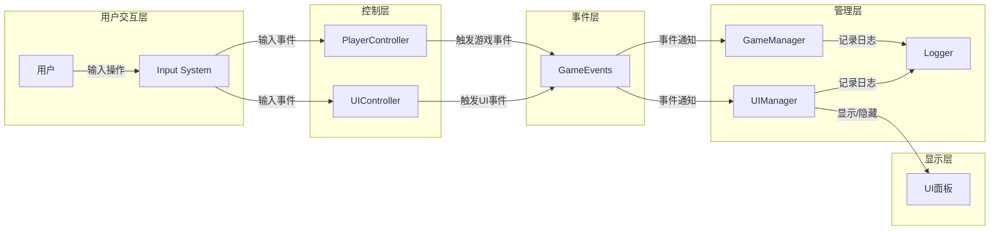

# GameJamToolPack

## 📦 项目介绍

GameJamToolPack 是一个专为游戏开发比赛（Game Jam）设计的Unity工具包，旨在帮助开发者快速构建游戏原型和完整游戏。它提供了一系列经过优化的核心系统和组件，包括UI管理、事件系统、玩家控制、日志系统等，让开发团队能够专注于游戏创意和玩法实现。

## 🚀 核心功能模块

### UI管理系统
- 基于事件驱动的UI管理器（UIManager）
- 灵活的UI面板注册和显隐控制
- UI状态互斥管理
- 加载界面系统

**详细文档：**
- [UI系统架构](Assets/Scripts/UI/Tech%20Doc/UI_System_Architecture.md)
- [UIManager流程图](Assets/Scripts/UI/Tech%20Doc/UIManager_Flow_Diagram.md)
- [UI开关控制时序](Assets/Scripts/UI/Tech%20Doc/UI_Switch_Control_Sequence.md)
- [MVC架构与UIManager协作](Assets/Scripts/UI/Tech%20Doc/MVC_UIManager_Collaboration_Sequence.md)

### 玩家控制模块
- 基于Unity Input System的跨平台输入处理
- 支持键盘鼠标、游戏手柄和触摸输入
- 预配置的常用输入映射
- 事件驱动的输入处理方式

**详细文档：**
- [Control模块文档](Assets/Scripts/Player/README.md)

### 日志系统
- 分级日志输出（Error、Warning、Info、Debug）
- 模块分类的日志记录
- 彩色日志输出
- 上下文对象支持（方便调试）

**详细文档：**
- [Logger模块使用文档](Assets/Scripts/Logger/README.md)

### 事件系统
- 全局事件分发中心
- 类型安全的事件订阅和触发
- 低耦合的模块间通信

## 📁 项目目录结构

```
GameJamToolPack/
├── Assets/
│   ├── Scripts/
│   │   ├── Core/            # 核心系统
│   │   ├── UI/              # UI系统
│   │   │   ├── Core/        # UI核心组件
│   │   │   └── Tech Doc/    # UI技术文档
│   │   ├── Player/          # 玩家控制
│   │   ├── Logger/          # 日志系统
│   │   └── GameEvents/      # 事件系统
│   ├── Settings/            # 项目设置
│   │   └── Input System/    # 输入系统配置
│   └── Prefabs/             # 预制件
├── README.md                # 项目主文档
└── README.html              # 项目主页（图表展示）
```

## 🛠️ 快速开始

### 1. 导入项目
- 使用Unity 2020.3或更高版本打开项目
- 确保安装了Unity Input System包

### 2. 核心系统设置
1. 在场景中添加GameManager、UIManager、PlayerController等核心管理器
2. 根据需要配置UI面板和输入映射
3. 参考各模块文档实现具体功能

## 📚 文档导航

| 模块 | 主要职责 | 文档路径 |
|------|---------|---------|
| UI系统 | 管理所有UI面板的显隐和交互 | [Assets/Scripts/UI/Tech Doc/](Assets/Scripts/UI/Tech%20Doc/) |
| 玩家控制 | 处理用户输入和角色控制 | [Assets/Scripts/Player/README.md](Assets/Scripts/Player/README.md) |
| 日志系统 | 提供统一的日志记录功能 | [Assets/Scripts/Logger/README.md](Assets/Scripts/Logger/README.md) |

## 🔄 系统交互概览



## 📝 贡献指南
- 在开发新功能前，请先查看相关模块的技术文档
- 遵循项目的代码规范和命名约定
- 为新功能添加详细的文档说明
- 提交代码前确保通过基本测试

## 📅 更新记录

**最新更新：**
- 优化了UIManager的面板注册和初始化机制
- 添加了辅助方法以提高代码可读性和可维护性
- 完善了各模块的技术文档