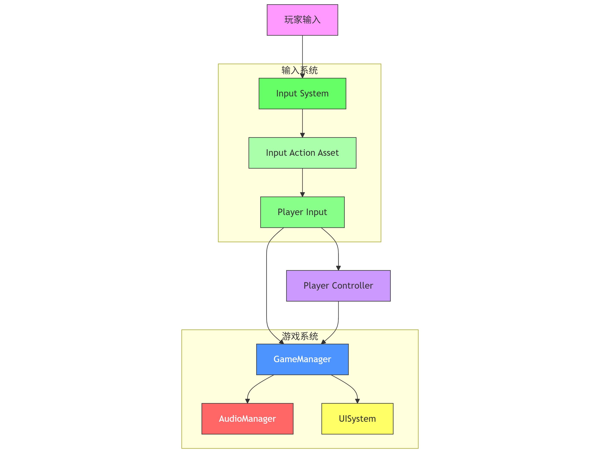
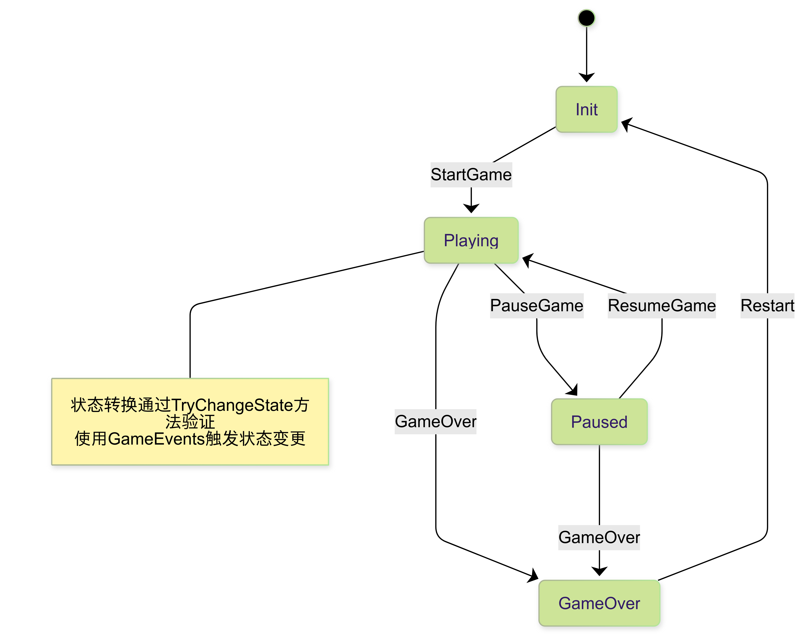
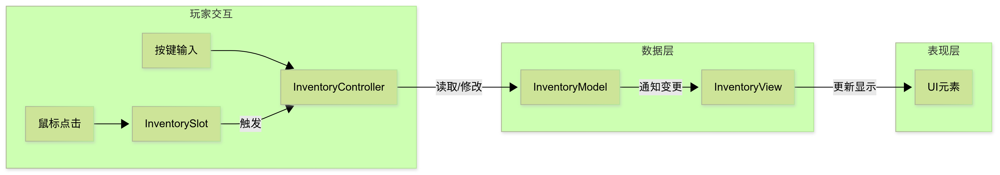
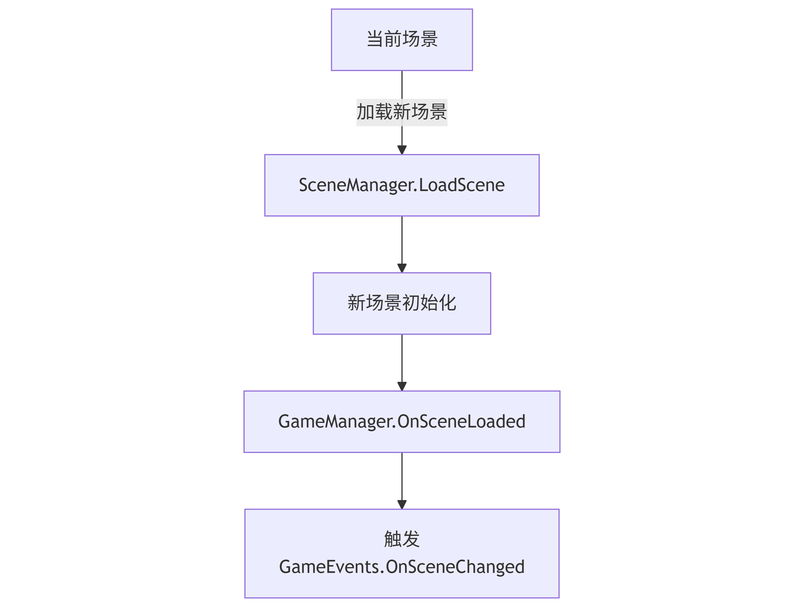
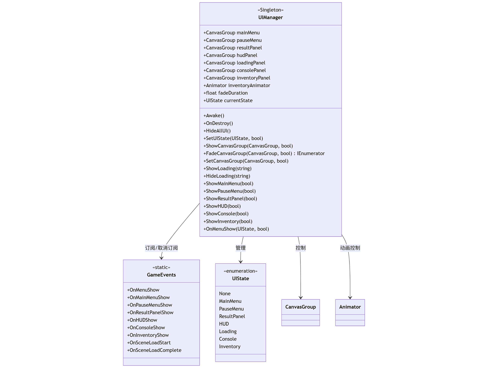

# 🎮 Unity Game Jam 工具箱
针对gamejam中unity游戏开发的神奇妙妙工具，快速组装拼好游，目前为2D游戏开发框架:)

## 📦 预制件架构

### 系统数据流


### 状态管理流程


## 🛠 使用说明

### 核心预制件
| 预制件名称      | 功能描述                  | 依赖关系         |
|----------------|--------------------------|------------------|
| GameManager    | 全局状态管理              | 无              |
| AudioManager   | 音效播放控制              | GameManager     |
| UIManager      | UI 管理                  | GameManager     |
| PlayerController| 玩家控制器                | 无              |

### 示例代码
```csharp
// 状态切换
GameManager.Instance.ChangeState(GameState.Paused);
```

## 🎮 操作控制

### 基础控制(以键鼠为例)
| 按键       | 功能描述                  | 对应方法               |
|------------|--------------------------|-----------------------|
| WASD       | 角色移动                  | PlayerController.Move |
| 空格       | 跳跃                      | PlayerController.Jump |
| F          | 交互/拾取                 | PlayerController.Interact |
| ESC        | 暂停菜单                  | GameManager.PauseGame |


### 背包系统控制
| 按键       | 功能描述                  | 对应方法               |
|------------|--------------------------|-----------------------|
| 鼠标左键   | 选择物品                  | InventorySlot.OnSlotClick |
| 拖拽       | 移动物品                  | InventorySlot.OnBeginDrag/OnEndDrag |
| 右键       | 使用物品                  | InventoryController.UseItem |




## 🔄 场景切换

### 场景管理流程


### 示例代码
```csharp
// 加载场景
SceneManager.LoadScene("Start");

// 监听场景加载完成事件
GameEvents.OnSceneChanged += (newScene) => {
    Debug.Log($"场景已切换至: {newScene.name}");
};
```

> 场景切换会触发GameManager的状态重置，请确保在场景切换前保存必要数据。

## 🖥 UI管理系统

### 核心功能
- **全局UI管理**：通过单例模式管理所有UI界面
- **状态管理**：定义7种UI状态(主菜单、暂停菜单等)并处理互斥关系
- **动画系统**：支持两种动画实现方式(协程淡入淡出和Animator状态机)
- **事件驱动**：通过GameEvents与其他模块通信


### 调试控制台（功能待实现）
| 快捷键     | 功能描述                  |
|------------|--------------------------|
| ~          | 打开/关闭控制台           |
| ↑↓        | 命令历史导航              |
| Enter      | 执行命令                  |

> 所有按键绑定可在`GameControl.inputsettings`中修改

> 所有图表使用 Mermaid 设计，导出为 PNG 格式  
> 最后更新: {2025.6.26}