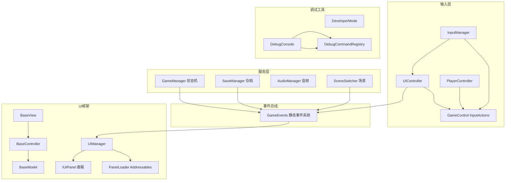

# GameJamToolPack 技术设计文档

> 版本：1.0
> 适用对象：开发团队成员、后续接入者、维护者
> 状态：架构搭建阶段（不保证向后兼容）

---

## 1. 项目概述

### 1.1 项目定位

GameJamToolPack 是一个面向游戏开发比赛（Game Jam）的 Unity 工具包，目标是为开发者提供一套经过优化的核心系统与组件，覆盖 UI 管理、事件通信、玩家输入、日志、存档、设置、调试工具等领域，使团队能够把精力集中在游戏创意与玩法实现上。

### 1.2 设计目标

- **可复用**：核心系统与具体游戏解耦，通过接口/契约注入玩法差异（如存档的 `IGameplaySaveProvider`）。
- **数据驱动**：UI 面板、设置项、存档槽位等尽可能用 ScriptableObject 配置表描述，减少硬编码。
- **低耦合**：模块间通过全局事件总线（`GameEvents`）通信，避免直接引用。
- **易调试**：内置开发者模式与调试控制台，支持命令行式运行时调试。
- **对 modder 友好**：面向 mod 开发者的开发者模式开关与可扩展命令系统（当前为基础阶段）。

### 1.3 技术栈概览

| 维度 | 选型 |
|---|---|
| 引擎 | Unity 2022.3.58f1c1（LTS） |
| 渲染管线 | Universal Render Pipeline（URP 14.0.11） |
| 资源管理 | Addressables 1.22.3 |
| 输入 | Input System 1.11.2 |
| 文本 | TextMeshPro 3.0.9 |
| 摄像机 | Cinemachine 2.10.3 |
| 语言 | C#（.NET Standard 2.1） |
| 架构模式 | MVC + 事件驱动 + 单例服务 |

---

## 2. 架构设计

### 2.1 总体分层

```
┌─────────────────────────────────────────────────────────┐
│  表现层（View）                                          │
│  BaseView<TController> → 各面板 View（MonoBehaviour）    │
├─────────────────────────────────────────────────────────┤
│  控制层（Controller）                                    │
│  BaseController<TView,TModel> → 各面板 Controller       │
├─────────────────────────────────────────────────────────┤
│  模型层（Model）                                         │
│  BaseModel / ObservableModel → 各面板 Model（纯 C#）     │
├─────────────────────────────────────────────────────────┤
│  服务层（Service）                                       │
│  GameManager / SaveManager / AudioManager /             │
│  InputManager / DialogueManager / DebugConsole          │
├─────────────────────────────────────────────────────────┤
│  基础设施层（Infrastructure）                            │
│  Singleton / GameEvents / Logger / Addressables /       │
│  SceneSwitcher / PanelLoader                            │
└─────────────────────────────────────────────────────────┘
```

### 2.2 核心架构模式

#### 2.2.1 MVC 分层

所有 UI 面板遵循 MVC 三层：

- **View**（`BaseView<TController>`）：负责显示与用户输入，绑定 Controller，**不直接访问 Model**。
- **Controller**（`BaseController<TView,TModel>`）：持有 View 与 Model 引用，中转所有数据读写。
- **Model**（`BaseModel` / `ObservableModel`）：纯 C# 类，不继承 MonoBehaviour，由 Controller 通过 `new()` 创建；`ObservableModel` 额外提供 `OnPropertyChanged` 属性变更通知。

```csharp
// 控制器创建模型（由 BaseController 提供）
protected TModel CreateAndInitializeModel();

// Model 属性变更通知（ObservableModel 提供）
protected bool SetProperty<T>(ref T field, T value, string propertyName);
```

#### 2.2.2 事件驱动

模块间通信统一通过静态事件总线 [GameEvents.cs](../Assets/Scripts/Core/Events/GameEvents.cs) 完成，事件覆盖游戏流程、场景管理、存档、设置、UI 五大类。部分模块使用独立事件总线（如对话模块的 `DialogueEvents`），避免占用核心总线。

#### 2.2.3 单例服务

跨场景常驻的管理器统一继承泛型单例 [Singleton<T>](../Assets/Scripts/Core/Singleton/Singleton.cs)，支持：

- 场景已存在实例优先查找；
- 缺失时挂载到 `Managers` 根对象并 `DontDestroyOnLoad`；
- 重复实例自动销毁（仅销毁组件，保留共用的 `Managers` 根对象）；
- 销毁后禁止懒创建，避免退出阶段生成残留对象。

#### 2.2.4 资源加载

资源与场景统一走 Addressables：

- 面板由 [PanelLoader.cs](../Assets/Scripts/UI/Core/PanelLoader.cs) 按 `UIConfig` 中的地址异步加载；
- 场景由 [SceneSwitcher.cs](../Assets/Scripts/Core/Scene/SceneSwitcher.cs) 按地址映射加载。

### 2.3 总体架构图



### 2.4 游戏状态机

[GameManager.cs](../Assets/Scripts/Core/GameManager.cs) 维护游戏状态 `GameState`，合法转换关系：

| 当前状态 | 允许转换 |
|---|---|
| `Init` | `Menu` |
| `Menu` | `Playing`、`Menu` |
| `Playing` | `Paused`、`GameOver`、`Playing` |
| `Paused` | `Playing`、`GameOver`、`Menu`、`Paused` |
| `GameOver` | `Menu`、`Playing`、`GameOver` |

非法切换会被拒绝并记录警告。状态切换同步控制 `Time.timeScale`（暂停为 0，其余为 1）。

---

## 3. 技术选型

| 包名 | 版本 | 用途 |
|---|---|---|
| `com.unity.addressables` | 1.22.3 | 资源与场景异步加载、远程更新 |
| `com.unity.inputsystem` | 1.11.2 | 跨平台输入（键盘/手柄/触摸） |
| `com.unity.textmeshpro` | 3.0.9 | 文本渲染 |
| `com.unity.render-pipelines.universal` | 14.0.11 | URP 渲染管线 |
| `com.unity.cinemachine` | 2.10.3 | 摄像机控制 |
| `com.unity.test-framework` | 1.1.33 | 单元/集成测试 |
| `com.unity.burst` | 1.8.19 | 高性能计算（预留） |
| `com.unity.mathematics` | 1.2.6 | 数学库 |
| `com.unity.timeline` | 1.7.6 | 过场/时序（预留） |
| `com.unity.visualscripting` | 1.9.4 | 可视化脚本（预留） |

选型说明：

- **Addressables** 是资源管理的单一事实来源，所有动态加载的 Prefab、场景、配置均通过地址寻址，支持后续热更新与 DLC。
- **Input System** 提供统一的输入抽象，通过 `GameControl.inputactions` 定义 `GamePlay` 与 `UI` 两个 ActionMap。
- **URP** 提供低/中/高三档画质配置（`URP-Performant` / `URP-Balanced` / `URP-HighFidelity`）。

---

## 4. 模块划分

### 4.1 核心层（Core）

| 类 | 职责 |
|---|---|
| `GameManager` | 游戏主流程与状态机 |
| `InputManager` | Input System 实例管理与输入模式切换 |
| `Singleton<T>` | 泛型单例基类 |
| `SceneSwitcher` | 基于事件的 Addressables 场景加载 |
| `AudioListenerManager` | 保证场景中唯一 AudioListener |
| `ManagersBootstrap` | 首场景加载后按依赖顺序确认管理器存在 |
| `GameEvents` | 全局静态事件总线 |
| `ResolutionUtility` | 分辨率去重列表的单一事实来源 |

### 4.2 UI 层（UI）

#### 4.2.1 UI 框架（UI/Core）

| 类 | 职责 |
|---|---|
| `UIManager` | 面板注册、显隐调度、输入模式联动 |
| `PanelLoader` | Addressables 面板加载/卸载、Canvas 层级管理 |
| `UIConfig` | 面板配置资产（地址、懒加载、互斥、输入模式） |
| `SceneLoadingController` | 加载界面时序编排 |
| `BaseView` / `BaseController` / `BaseModel` | MVC 基类 |
| `IUIPanel` | 面板接口 |
| `UIType` | 面板类型枚举 |
| `UISortingOrder` | UI 层级常量 |

#### 4.2.2 业务面板

| 面板 | UIType | 说明 |
|---|---|---|
| MainMenu | `MainMenu` | 主菜单（场景入口面板） |
| SettingsPanel | `SettingsPanel` | 设置面板（数据表驱动） |
| SaveLoadMenu | `SaveLoadMenu` | 存档/读档菜单 |
| PauseMenu | `PauseMenu` | 暂停菜单 |
| HUD | `HUD` | 游戏内 HUD |
| Inventory | `Inventory` | 背包 |
| DialoguePanel | `DialoguePanel` | 对话面板 |
| ResultPanel | `ResultPanel` | 结算面板 |
| AboutPanel | `AboutPanel` | 关于面板 |
| Loading | `Loading` | 加载界面 |
| Console | `Console` | 调试控制台 |

### 4.3 音频层（Audio）

| 类 | 职责 |
|---|---|
| `IAudioService` | 音频服务抽象接口 |
| `AudioServiceLocator` | 音频服务定位器 |
| `AudioManager` | 音频服务实现（音乐/音效双 AudioSource） |

### 4.4 存档层（SaveLoad）

| 类 | 职责 |
|---|---|
| `SaveManager` | 存档门面：保存/加载/删除，玩法数据透传 |
| `ISaveSystem` | 存档系统接口 |
| `JsonSaveSystem` | JSON 文件存档实现（原子写入 + 备份恢复） |
| `SaveData` | 中立版存档数据结构 |
| `GameSettings` | 运行时设置模型 |
| `IGameplaySaveProvider` | 玩法存档契约（框架与游戏唯一扩展点） |

### 4.5 调试工具层（DevTools）

| 类 | 职责 |
|---|---|
| `DeveloperMode` | 开发者模式开关（modder 友好） |
| `DebugConsole` | 调试控制台 View |
| `DebugConsoleController` | 控制台控制器 |
| `DebugCommandRegistry` | 命令注册表（反射扫描 + 动态注册） |
| `DebugCommandAttribute` | 命令标记特性 |
| `CoreCommands` / `GameplayCommands` / `UiCommands` | 内置命令集 |

### 4.6 日志层（Logger）

| 类 | 职责 |
|---|---|
| `Log` | 分级日志输出（Error/Warning/Info/Debug） |
| `LogModules` | 模块名常量 |

### 4.7 玩家层（Player）

| 类 | 职责 |
|---|---|
| `PlayerController` | 玩家玩法输入读取（移动/交互/攻击/跳跃） |

---

## 5. 接口规范

### 5.1 IUIPanel

定义所有 UI 面板的基础契约：

```csharp
public interface IUIPanel
{
    void Show();
    void Hide();
    bool IsVisible { get; }
    UIType PanelType { get; }
    void Initialize();
    void Cleanup();
    void SetInteractable(bool interactable);
}
```

### 5.2 IAudioService 与 AudioServiceLocator

```csharp
public interface IAudioService
{
    float MusicVolume { get; }
    float SfxVolume { get; }
    void SetMusicVolume(float volume);
    void SetSfxVolume(float volume);
    void PlayMusic(AudioClip clip, bool loop = true);
    void StopMusic();
    void PlaySfx(AudioClip clip);
}

public static class AudioServiceLocator
{
    public static IAudioService Current { get; set; }
}
```

设置模块通过 `AudioServiceLocator.Current` 依赖抽象，不直接依赖 `AudioManager`。

### 5.3 IGameplaySaveProvider

框架与具体游戏之间的唯一存档扩展点：

```csharp
public interface IGameplaySaveProvider
{
    string CaptureGameplayDataJson();  // 序列化玩法状态；返回 null 表示本轮无数据
    string GetProgressSummary();        // 槽位显示的进度摘要
}
```

### 5.4 ISaveSystem

```csharp
public interface ISaveSystem
{
    bool SaveGame(SaveData data, string slotName);
    SaveData LoadGame(string slotName);
    bool DeleteGame(string slotName);
    bool DoesSaveExist(string slotName);
    DateTime GetSaveLastWriteTime(string slotName);
    List<string> GetAvailableSaves();
}
```

### 5.5 ISettingsValueProvider

设置面板 UI 与设置值读写之间的解耦接口：

```csharp
public interface ISettingsValueProvider
{
    object GetValue(string key);
    void SetValue(string key, object value);
}
```

### 5.6 IDialogueConditionProvider

对话选项条件判定契约：

```csharp
public interface IDialogueConditionProvider
{
    bool IsConditionMet(string conditionKey);
}
```

### 5.7 调试命令

命令通过 `[DebugCommand]` 特性标记静态方法：

```csharp
[AttributeUsage(AttributeTargets.Method)]
public sealed class DebugCommandAttribute : Attribute
{
    public string CommandName { get; }
    public string Category { get; set; }
    public string Description { get; set; }
    public string Usage { get; set; }
    public string[] Aliases { get; set; }
    public string Params { get; set; }
}
```

方法签名约定：`CommandResult Xxx(DebugCommandContext ctx, string[] args)`，返回 `void` 亦可。

### 5.8 ObservableModel

需要属性变更通知的 Model 继承 `ObservableModel`，属性 setter 使用标准模式：

```csharp
public float MusicVolume
{
    get => m_musicVolume;
    set { if (SetProperty(ref m_musicVolume, value, nameof(MusicVolume))) { /* 副作用 */ } }
}
```

---

## 6. 数据模型

### 6.1 存档数据（SaveData）

`[Serializable]`，数据版本 `CURRENT_DATA_VERSION = 2`：

| 字段 | 类型 | 说明 |
|---|---|---|
| `gameplayDataJson` | string | 玩法自有 JSON（透传） |
| `progressSummary` | string | 进度摘要 |
| `musicVolume` / `sfxVolume` | float | 音量 |
| `qualityLevel` | int | 画质等级 |
| `fullscreen` | bool | 全屏 |
| `resolutionIndex` | int | 分辨率索引 |
| `invertYAxis` | bool | Y 轴反转 |
| `saveTime` / `saveTimeUtc` | 时间戳 | 元数据 |
| `dataVersion` | int | 结构版本（迁移用） |
| `version` | string | 发布版本提示 |

### 6.2 设置模型（GameSettings / SettingsModel）

运行时设置属性（音量、画质、全屏、分辨率、Y 轴反转、开发者模式），持久化键由 [SettingsKeys.cs](../Assets/Scripts/SaveLoad/DataModels/SettingsKeys.cs) 统一定义，避免键名分散。

### 6.3 背包数据

- `ItemData`（ScriptableObject）：物品定义（ID、名称、描述、图标、堆叠上限、Prefab、类型）。
- `ItemType` 枚举：`Consumable / Weapon / Armor / Material / Quest`。
- `InventoryItem`：背包条目（`ItemID` + `Quantity`）。
- `InventoryModel`：背包模型（容量 20，增删/堆叠/位置交换，`OnInventoryChanged` 通知）。

### 6.4 对话数据

- `DialogueNode`：节点（nodeId、speakerName、text、choices、nextNodeId）。
- `DialogueChoice`：选项（choiceText、nextNodeId、conditionKey）。
- `DialogueData`（ScriptableObject）：对话资产（起始节点 + 节点列表，含 `Validate()` 校验）。
- `DialogueState`：对话状态快照（供存档归口）。

### 6.5 UI 配置（UIConfig）

- `PanelEntry`：单个面板条目（`panelType`、`addressableAddress`、`lazyLoad`、`inputMode`、`hideOnShow`）。
- `PanelInputMode` 枚举：`None / UI / Gameplay`。

### 6.6 设置项数据（SettingsCatalog）

- `SettingsOptionType` 枚举：`Header / Slider / Toggle / Dropdown`。
- `SettingsOptionDefinition`：设置项定义（key、title、type、minValue、maxValue、wholeNumbers、options）。

---

## 7. 开发环境配置

### 7.1 环境要求

- Unity 2022.3.58f1c1（LTS，`ProjectVersion.txt` 中声明）。
- .NET Standard 2.1，C# 语言版本跟随 Unity 默认。
- 操作系统：Windows（当前开发环境）。

### 7.2 依赖包

依赖声明见 [Packages/manifest.json](../Packages/manifest.json)，核心依赖见第 3 节。

### 7.3 场景配置

| 场景 | 加载方式 | 地址 |
|---|---|---|
| `MainMenu.unity` | 内置入口（Build Settings） | `Assets/Scenes/MainMenu.unity` |
| `Level Select.unity` | Addressable | `Scenes/Level Select` |

场景加载通过 `SceneSwitcher.s_sceneAddressMap` 维护名称到地址的映射，新增场景需在此登记。

### 7.4 Addressables 分组

- `Config`：配置文件（`UIConfig`、`SettingsCatalog`、`SaveLoadMenuConfig`）。
- `Scenes`：Addressable 场景。
- `UI` / `Prefabs`：UI 面板与预制件。
- `Fonts`：字体（思源黑体 SourceHanSansSC）。
- `Images`：图片资源。
- 部分组启用了 Content Update（远程更新）。

### 7.5 配置资产

| 资产 | 地址 | 用途 |
|---|---|---|
| `UIConfig.asset` | `Config/UIConfig` | 面板注册表 |
| `SettingsCatalog.asset` | `Config/SettingsCatalog` | 设置项数据表 |
| `SaveLoadMenuConfig.asset` | — | 存档菜单配置 |

---

## 8. 编码规范

### 8.1 基本规则（`.editorconfig`）

- 编码 UTF-8；
- 4 空格缩进（不使用 Tab）；
- 行尾 CRLF；
- 去除行尾空白；
- 文件末尾保留一个换行；
- 抑制 Unity 生命周期函数的未使用警告（`IDE0051`）。

### 8.2 命名规范

| 对象 | 规范 | 示例 |
|---|---|---|
| 命名空间 | `MyGame.<模块>` | `MyGame.UI.Settings.Model` |
| 类/接口 | PascalCase，接口加 `I` 前缀 | `SaveManager`、`IAudioService` |
| 公共属性 | PascalCase | `MusicVolume` |
| 公共方法 | PascalCase | `SaveCurrentGame` |
| 私有实例字段 | `m_` 前缀 camelCase | `m_musicVolume` |
| 私有静态字段 | `s_` 前缀 camelCase | `s_cachedResolutions` |
| 常量 | PascalCase 或 UPPER_SNAKE | `CURRENT_DATA_VERSION`、`DEFAULT_SAVE_SLOT` |
| 局部变量 | camelCase | `currentValue` |

### 8.3 注释规范

- 类、公共方法、字段均要求中文注释说明职责与参数；
- 函数级注释必须包含，重点说明"为什么"而非"是什么"；
- 涉及非显而易见逻辑（如防回环、原子写入、索引错位规避）需就地注释。

### 8.4 架构规范

- View 不直接访问 Model，所有数据读写由 Controller 中转；
- 模块间通信优先使用 `GameEvents`，避免直接对象引用；
- 跨场景对象使用 `Singleton<T>`，子类重写 `Awake`/`OnDestroy` 必须调用 `base`；
- 资源加载统一走 Addressables，禁止硬编码资源路径；
- 避免魔法数字，可配置项下沉到 config（ScriptableObject 或常量类）；
- 按钮事件在 `Initialize()` 中绑定、在 `Cleanup()` 中解绑，成对出现。

### 8.5 日志规范

- 统一使用 `Log` 类，模块名使用 `LogModules` 常量；
- 错误用 `Error`、异常分支用 `Warning`、关键流程用 `Info`、开发细节用 `DebugLog`；
- 高频日志（滑块拖动、每帧状态）使用 `InfoWithCooldown` 防刷屏。

---

## 9. 测试策略

### 9.1 测试基础设施

- 已配置 `com.unity.test-framework`（1.1.33）与 `com.unity.ext.nunit`（1.0.6），支持 EditMode 与 PlayMode 测试。
- 当前阶段尚未建立完整的测试用例，测试工作随架构稳定后补充。

### 9.2 测试分层建议

| 层级 | 范围 | 示例 |
|---|---|---|
| 单元测试（EditMode） | 纯 C# 逻辑，无场景依赖 | `JsonSaveSystem` 读写、`InventoryModel` 增删、`DialogueManager` 节点推进、`ResolutionUtility` 去重、`DebugCommandRegistry` 解析 |
| 集成测试（PlayMode） | 场景内管理器协作 | 状态机转换合法性、存档事件链路、UI 面板显隐互斥 |

### 9.3 测试重点

- **存档健壮性**：`JsonSaveSystem` 的原子写入、损坏恢复、文件名消毒、版本迁移。
- **状态机**：`GameManager` 的非法转换拒绝与 `Time.timeScale` 联动。
- **事件解耦**：订阅/退订成对，避免场景切换后的悬空引用。
- **命令系统**：参数校验（个数/类型/引号分词）与异常捕获。

---

## 10. 部署流程

### 10.1 构建前准备

1. 确认 `ProjectSettings/EditorBuildSettings.asset` 中入口场景为 `MainMenu.unity`；
2. 确认 Addressables 各分组已正确分配资源地址；
3. 确认 `SceneSwitcher.s_sceneAddressMap` 中登记了所有可加载场景。

### 10.2 Addressables 构建

- 使用 `BuildScriptPackedMode`（打包模式）生成 AssetBundle；
- 支持 Fast / Virtual 模式用于编辑器调试与快速迭代；
- 启用 Content Update 的分组需生成内容更新目录，用于远程资源更新。

### 10.3 平台构建

- 目标平台以 Standalone（Windows）为主，Input System 已配置跨平台映射；
- 画质档位（Performant / Balanced / HighFidelity）通过 QualitySettings 预置，运行时由设置面板切换。

### 10.4 部署产物

- 主程序 + Addressables 打包产物（AssetBundle + 目录结构）；
- 若启用远程更新，将更新包发布至 CDN，客户端按 catalog 拉取。

---

## 11. 风险评估

### 11.1 架构性风险

| 风险 | 影响 | 缓解建议 |
|---|---|---|
| 未划分 Assembly Definition | 代码全部编译进 `Assembly-CSharp`，无法隔离核心 API 与实现，阻碍 mod 独立编译与运行时加载 | 引入 asmdef 分层（`MyGame.ModApi` → `MyGame.Runtime`），建立单向依赖 |
| modder 友好度不足 | 命令反射只扫当前程序集、事件系统封闭、数据表运行时不可注入，mod 生态受限 | 提供统一 mod 生命周期（`IMod`/`ModLoader`）、跨程序集命令扫描、开放事件通道 |
| 单例 + 静态事件耦合 | 单例与静态事件较难做单元测试隔离，场景切换存在悬空订阅风险 | 保持订阅/退订成对；核心逻辑下沉为可测试的纯 C# 类 |

### 11.2 性能风险

| 风险 | 影响 | 缓解建议 |
|---|---|---|
| `WaitForCompletion()` 同步阻塞加载 | 首次加载 Catalog/配置时可能卡帧 | 小资产可接受；大资产改为异步 `await` |
| 设置全量刷新 | 任一属性变化刷新全部行 | 按 key 定向刷新 |
| 日志冷却字典无限增长（已修复） | 内存泄漏隐患 | 冷却 key 固定化（已落地） |

### 11.3 数据完整性风险

| 风险 | 影响 | 缓解建议 |
|---|---|---|
| 存档损坏/写入中断 | 玩家进度丢失 | `JsonSaveSystem` 已实现原子写入 + 备份恢复 + 损坏隔离 |
| 分辨率索引错位 | 分辨率设置错乱 | `ResolutionUtility` 统一去重列表，UI 与 Apply 共用 |

### 11.4 兼容性风险

- 项目处于架构搭建阶段，规则明确"不保证向后兼容"，模块重构（如设置面板由生成器改为纯代码布局）可能引入短期的接口变动，需在团队内同步。

---

## 附：关键术语

| 术语 | 说明 |
|---|---|
| MVC | Model-View-Controller 分层 |
| ObservableModel | 带属性变更通知的 Model 基类 |
| Addressables | Unity 资源/场景异步加载与远程更新方案 |
| ActionMap | Input System 中一组相关输入动作 |
| 懒加载（lazyLoad） | 首次显示时才加载面板资源 |
| 内容更新（Content Update） | Addressables 增量更新机制 |
